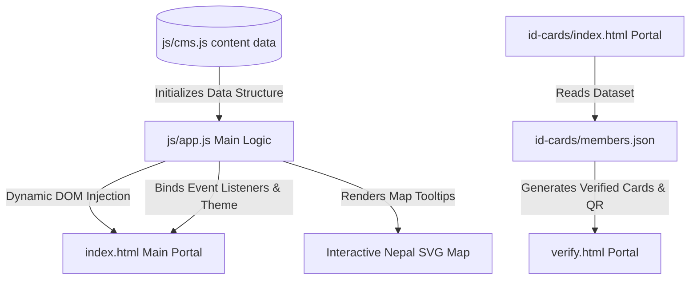

# 🇳🇵 Navigo Nepal Web Dashboard

[](https://opensource.org/licenses/MIT)
[](https://html.spec.whatwg.org/)
[](https://www.w3.org/TR/css-3-themes/)
[](https://developer.mozilla.org/en-US/docs/Web/JavaScript)
[](#seo--performance)

Welcome to the official repository of **Navigo Nepal**, a premium, high-fidelity, client-side data-driven web portal and dashboard designed for a leading youth-led educational empowerment organization. Navigo Nepal is transforming educational ecosystems across Nepal through STEM education, Olympiad awareness, global mentorship pipelines, and leadership incubators.

This web dashboard displays nationwide community impact, dynamic portfolios, interactive geography-based tracking, and client-side CMS updates.

---

##  Key Features

*   **Client-Side CMS Architecture**: Powered by a unified data store ([js/cms.js](file:///d:/navigonepal/js/cms.js)) to manage content dynamically, including programs, metrics, stories, resources, and volunteer listings.
*   **Interactive Vector GIS Mapping**: A premium, custom-styled SVG map of Nepal's provinces that shows real-time stats (schools reached, students mentored, active clubs) upon hover and selection.
*   **Global Search & Autocomplete Engine**: A custom search console with text auto-completion and province/district filtering to connect students to local resources instantly.
*   **Impact Bento Grid**: Dynamically counts and displays organization stats (25,000+ Students, 120+ Schools, 24+ Districts) with counting animations.
*   **Dual-Theme Mode (Dark/Light)**: Responsive design that matches preferences automatically or enables toggling between modes.
*   **Micro-Animations & Visual Excellence**: Premium glassmorphism effects, custom HSL gradients, cinematic scroll progress, scroll reveal triggers, and page-load transitions.
*   **Dynamic Modals**: Fully integrated forms for volunteer registration, partner/sponsor application, and secure checkout sponsorships.

---

##  Repository Structure

```tree
d:/navigonepal
├── assets/                    # Graphic assets, logos, member photos, and images
│   ├── advisory/              # Advisory board member photos
│   ├── how-we-are-unique/     # Visual gallery images
│   ├── members/               # Team member photos & default avatars
│   ├── mentor/                # Mentor photo gallery
│   ├── our-vision/            # Vision section background graphics
│   └── partner/               # Partner & ecosystem logos
├── css/
│   ├── style.css              # Main design system & responsive styling
│   ├── programs.css           # Program cards & grid styling
│   └── team.css               # Team page & coordinator layout styling
├── js/
│   ├── app.js                 # Primary interactive logic & UI controllers
│   ├── cms.js                 # Unified client-side content management
│   ├── form-handler.js        # Dynamic modal & Formspree form submission handler
│   ├── maintenance.js         # Site maintenance mode guard
│   └── theme.js               # Dark/Light theme state manager
├── docs/                      # Technical documentation & project proposals
│   ├── FORMSPREE_SETUP.md     # Formspree backend integration setup guide
│   ├── design.md              # UI/UX design specifications & color palette
│   └── Navigo-Nepal-*.md      # Technical proposal & requirement documents
├── id-cards/                  # Digital & Printable Member ID Card Generator tool
│   ├── index.html             # ID card generation portal
│   ├── verify.html            # Digital ID card verification portal
│   ├── id-card-script.js      # Card rendering & QR code generation logic
│   └── members.json           # Member identity dataset
├── index.html                 # Main landing dashboard portal
├── our-story.html             # Organization founding narrative & timeline
├── programs.html              # Core initiatives & project portfolio
├── team.html                  # Leadership, team members & advisory board
├── volunteer.html             # Volunteer registration portal
├── join.html                  # Membership & community registration portal
├── intern.html                # Internship opportunities portal
├── propose-project.html       # Project proposal submission portal
├── past-events.html           # Historical event gallery & highlights
├── donate.html                # Donation & supporter contribution portal
├── verify.html                # Main QR-code member profile verification portal
├── admin.html                 # Local CMS management dashboard
├── maintenance.html           # Maintenance landing page
└── README.md                  # Project documentation (this file)
```

---

##  System Architecture

The dashboard is engineered with a separation of concerns, decoupling structural markup from high-fidelity content structures.



---

##  SEO & Performance

*   **Semantic Elements**: Structured using HTML5 tags (`<nav>`, `<header>`, `<main>`, `<section>`, `<aside>`, `<footer>`) to optimize search engine crawling and screen reader accessibility.
*   **Meta Parameters**: Contains comprehensive SEO titles, meta-descriptions, keywords, viewport adjustments, and Open Graph tags for social media shares.
*   **Web Performance Optimized**: Zero heavy framework overhead or blocking JS scripts. CSS stylesheets load first, and Javascript uses `DOMContentLoaded` with async hooks to keep PageSpeed scores optimal.

---

##  License

Distributed under the MIT License. See `LICENSE` for details.

---

<p align="center">Made with ❤️ for the youth, leaders, and innovators of Nepal.</p>
