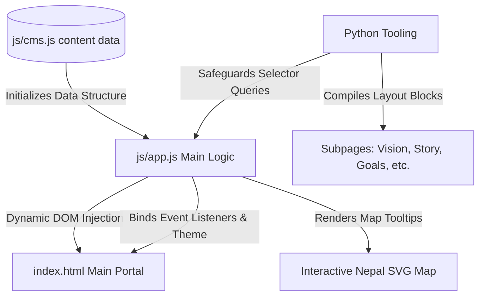

# 🇳🇵 Navigo Nepal Web Dashboard

[](https://opensource.org/licenses/MIT)
[](https://html.spec.whatwg.org/)
[](https://www.w3.org/TR/css-3-themes/)
[](https://developer.mozilla.org/en-US/docs/Web/JavaScript)
[](#seo--performance)

Welcome to the official repository of **Navigo Nepal**, a premium, high-fidelity, client-side data-driven web portal and dashboard designed for a leading youth-led educational empowerment organization. Navigo Nepal is transforming educational ecosystems across Nepal through STEM education, Olympiad awareness, global mentorship pipelines, and leadership incubators.

This web dashboard displays nationwide community impact, dynamic portfolios, interactive geography-based tracking, and client-side CMS updates.

---

## 🚀 Key Features

*   **Client-Side CMS Architecture**: Powered by a unified data store ([js/cms.js](file:///d:/navigonepal/js/cms.js)) to manage content dynamically, including programs, metrics, stories, resources, and volunteer listings.
*   **Interactive Vector GIS Mapping**: A premium, custom-styled SVG map of Nepal's provinces that shows real-time stats (schools reached, students mentored, active clubs) upon hover and selection.
*   **Global Search & Autocomplete Engine**: A custom search console with text auto-completion and province/district filtering to connect students to local resources instantly.
*   **Impact Bento Grid**: Dynamically counts and displays organization stats (25,000+ Students, 120+ Schools, 35+ Districts) with counting animations.
*   **Dual-Theme Mode (Dark/Light)**: Responsive design that matches preferences automatically or enables toggling between modes.
*   **Micro-Animations & Visual Excellence**: Premium glassmorphism effects, custom HSL gradients, cinematic scroll progress, scroll reveal triggers, and page-load transitions.
*   **Dynamic Modals**: Fully integrated forms for volunteer registration, partner/sponsor application, and secure checkout sponsorships.

---

## 📁 Repository Structure

```tree
d:/navigonepal
├── assets/                    # Graphic assets and images
├── css/
│   ├── style.css              # Custom styling sheet
│   └── style_old.css          # Deprecated stylesheet archive
├── js/
│   ├── app.js                 # Primary dashboard and application logic
│   └── cms.js                 # Unified client-side content management
├── index.html                 # Main landing dashboard
├── our-vision.html            # Vision and core values subpage
├── founding-story.html        # Historical timeline and startup narrative
├── leadership-message.html    # Co-founder message & leadership values
├── future-goals.html          # Dynamic goals and progress meters
├── extract_pages.py           # Subpage automation compiler
├── safeguard_js.py            # Selector protection for multi-page routing
└── README.md                  # Project documentation (this file)
```

---

## 🛠️ System Architecture

The dashboard is engineered with a separation of concerns, decoupling structural markup from high-fidelity content structures.



### Core Architecture Components

1.  **Unified Content Registry ([js/cms.js](file:///d:/navigonepal/js/cms.js))**
    All textual content, portfolio grids, image paths, stats, and metadata are maintained here. To update the website, content administrators modify this file directly without writing HTML.
2.  **Dashboard Controller ([js/app.js](file:///d:/navigonepal/js/app.js))**
    Orchestrates the entire UI cycle:
    *   Loads JSON-like data structure from CMS.
    *   Fades in components with dynamic layouts.
    *   Sets up the `IntersectionObserver` to highlight navigation links active status.
    *   Initiates bento counter tickers when sections scroll into view.
    *   Manages the custom search input system and displays matches dynamically.
3.  **Visual System Framework ([css/style.css](file:///d:/navigonepal/css/style.css))**
    Includes root variables for light and dark modes, typography curves, customized flexbox layouts, grid layouts, scroll progress widgets, and keyframe definitions for ambient glowing orbits.

---

## 💻 Installation & Local Development

This project is a high-fidelity frontend static dashboard. It has no build step or node package requirements. You can run it locally with any simple HTTP server.

### Option 1: Live Server (Recommended)
If you are using Visual Studio Code, install the **Live Server** extension, open [index.html](file:///d:/navigonepal/index.html), and click **"Go Live"** on the status bar.

### Option 2: Python HTTP Server
Run the built-in HTTP server module with Python in the workspace root directory:

```bash
python -m http.server 8000
```
Then navigate to `http://localhost:8000` in your web browser.

---

## ⚙️ Development & Automation Tools

To simplify updating subpages and keeping selectors safe, the project includes several Python developer scripts:

*   **Subpage Generator ([extract_pages.py](file:///d:/navigonepal/extract_pages.py))**
    Automates generating subpages ([our-vision.html](file:///d:/navigonepal/our-vision.html), [founding-story.html](file:///d:/navigonepal/founding-story.html), [leadership-message.html](file:///d:/navigonepal/leadership-message.html), [future-goals.html](file:///d:/navigonepal/future-goals.html)) using section blocks from the main index. This guarantees layout templates (like headers, scripts, and styling references) remain consistent.
    
    ```bash
    python extract_pages.py
    ```

*   **JS Robustness Utility ([safeguard_js.py](file:///d:/navigonepal/safeguard_js.py))**
    Updates [js/app.js](file:///d:/navigonepal/js/app.js) to check that query selectors are not null before updating elements. This ensures scripts run without errors on subpages that do not contain all the main home page's HTML elements.
    
    ```bash
    python safeguard_js.py
    ```

---

## 🌐 SEO & Performance

*   **Semantic Elements**: Structured using HTML5 tags (`<nav>`, `<header>`, `<main>`, `<section>`, `<aside>`, `<footer>`) to optimize search engine crawling and screen reader accessibility.
*   **Meta Parameters**: Contains comprehensive SEO titles, meta-descriptions, keywords, viewport adjustments, and Open Graph tags for social media shares.
*   **Web Performance Optimized**: Zero heavy framework overhead or blocking JS scripts. CSS stylesheets load first, and Javascript uses `DOMContentLoaded` with async hooks to keep PageSpeed scores optimal.

---

## ⚖️ License

Distributed under the MIT License. See `LICENSE` for details.

---

<p align="center">Made with ❤️ for the youth, leaders, and innovators of Nepal.</p>
